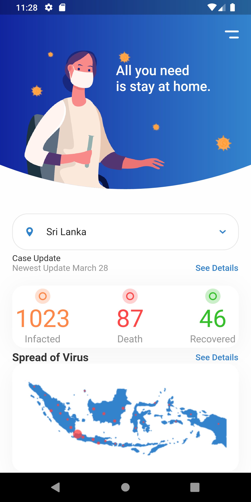

# flutter_ui_sample

This flutter application developed to test the new ui screens.. In this project, Every branch open to create new uiScreens

# Screenshots

## Github repo - 2ndFlutterApp20200406

### Branch - 09stfull 
Added branch 8 created screenshots and original images which is design in XD...

  

  
  
  

## Github repo - FlutterUISample

## Branch 1 screenshot
 
